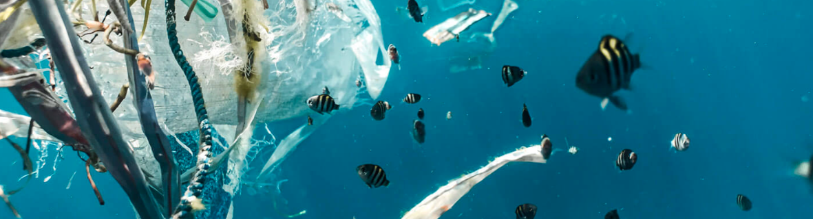

# Global plastics tracker

<div style="margin-top: 2rem; padding: 1rem; background-color: var(--theme-background-alt); border-radius: var(--theme-radius);">
  <p>
    The Global Plastics Data Tracker monitors plastics reporting across 180+ countries, providing:
  </p>
  <ul>
    <li><strong>Data sources:</strong> Access to government data sources on plastics data across the supply-chain</li>
    <li><strong>Data scores:</strong> “Data scores” for each source according to reporting frequency and granularity</li>
    <li><strong>Insight into global progress:</strong> Insight into the countries with the most developed plastics data and an evidence-base for the gaps in global plastics data reporting across the plastics supply-chain</li>
  </ul>
  <p>
    Developed ahead of the Intergovernmental Negotiating Committee’s fifth session (INC-5), this tracker establishes a crucial evidence base that illustrates the current global landscape of plastics data availability. It was specifically designed to inform treaty negotiators about critical gaps and opportunities for improvement in international plastics monitoring frameworks.
  </p>
  <p>
  Our team welcomes feedback to improve this tool for policymakers, researchers, and stakeholders. For feedback, updates or help, please explore our website or email <a href="mailto:helena.dickinson@unsw.edu.au">Helena Dickinson</a> or <a href="mailto:e.northrop@unsw.edu.au">Eliza Northrop</a>.
  </p>
  
  <a href="/1_about" style="display: inline-block; margin-top: 0em; padding: 0.5em 1em; background-color: var(--theme-foreground-focus); color: var(--theme-background); text-decoration: none; border-radius: 4px;">Learn more about the register and tools &raquo;</a>
</div>
  
## Plastics data registry

```js
// load the plastics data
const plastics_ratings_raw = FileAttachment("data/global_plastics_waste_data_ratings_current.csv").csv({typed: true});
// load the corresponding links data
const plastics_links_raw = FileAttachment("data/global_plastics_waste_data_links_current.csv").csv({typed: false}); // URLs are strings
```

```js
const valueColorMap = {
  0: "#D3D3D3", 1: "#E67E22 ", 2: "#FFD8B1",
  3: "#FFFFE0", 4: "#98FB98", 5: "#008000"
};

const scoreLegend = htl.html`<div class="color-legend-wrapper">
  <div class="color-legend">
    <strong class="legend-title">Data score colour coding:</strong>
    ${Object.entries(valueColorMap)
      .sort(([scoreA], [scoreB]) => parseInt(scoreA) - parseInt(scoreB))
      .map(([score, color]) => htl.html`
      <div class="legend-item">
        <span class="legend-swatch" style="background-color: ${color};"></span>
        <span class="legend-label">${score}</span>
      </div>
    `)}
  </div>
</div>`;
```

```js
const numericColumnsToColorAndLink = [
  "Domestic primary material", "Domestic Products", "Virgin content consumption",
  "Recycled content consumption", "Primary material trade (imports)",
  "Primary material trade (exports)", "Products (imports)", "Products (exports)",
  "Total generated plastic waste", "Waste recovered for recycling", "Waste to Energy",
  "Waste Incinerated (without energy recovery)", "Waste landfilled",
  "Waste (import)", "Waste (Export)"
];

const plastics_ratings_all_rows = plastics_ratings_raw.map((raw_rating_row, index) => {
  const processed_row = { __originalIndex: index };

  for (const key in raw_rating_row) {
    if (raw_rating_row.hasOwnProperty(key)) {
      if (key === "Country" || key === "Region" || key === "Type") {
        processed_row[key] = raw_rating_row[key];
      } else {
        const numVal = Number(raw_rating_row[key]);
        if (!isNaN(numVal) && String(raw_rating_row[key]).trim() !== "") {
          processed_row[key] = numVal;
        } else {
          processed_row[key] = raw_rating_row[key];
        }
      }
    }
  }

  if (plastics_links_raw && index < plastics_links_raw.length) {
    const link_data_for_row = plastics_links_raw[index];
    for (const colName of numericColumnsToColorAndLink) {
      if (processed_row.hasOwnProperty(colName)) {
        const currentValue = processed_row[colName];
        let urlValue = null;
        if (link_data_for_row && link_data_for_row.hasOwnProperty(colName)) {
          urlValue = String(link_data_for_row[colName]).trim();
        }
        processed_row[colName] = { value: currentValue, url: urlValue };
      }
    }
  } else {
    for (const colName of numericColumnsToColorAndLink) {
      if (processed_row.hasOwnProperty(colName)) {
        processed_row[colName] = { value: processed_row[colName], url: null };
      }
    }
  }
  return processed_row;
});

if (plastics_ratings_all_rows.length > 0) {
  console.log("DEBUG Block 3: First row of processed plastics_ratings_all_rows (check for {value, url} objects):", JSON.parse(JSON.stringify(plastics_ratings_all_rows[0])));
  if (numericColumnsToColorAndLink.length > 0 && plastics_ratings_all_rows[0].hasOwnProperty(numericColumnsToColorAndLink[0])) {
    console.log(`DEBUG Block 3: Content of first linkable column ('${numericColumnsToColorAndLink[0]}') in first row:`, JSON.parse(JSON.stringify(plastics_ratings_all_rows[0][numericColumnsToColorAndLink[0]])));
  }
}
if (!plastics_links_raw || plastics_links_raw.length === 0) {
  console.warn("WARNING Block 3: plastics_links_raw is empty or not loaded. URLs will be missing.");
}

const tableSearch = Inputs.search(plastics_ratings_all_rows, {
  placeholder: "Search table..."
});
const tableSearchValue = view(tableSearch);

if (plastics_links_raw && plastics_links_raw.length > 0 && plastics_ratings_all_rows.length > 0) {
  if (plastics_ratings_all_rows.length !== plastics_links_raw.length) {
    console.warn("WARNING Block 3: Row count mismatch between ratings data and links data!");
  }
}
```

```js
const colNames = plastics_ratings_all_rows.length > 0
  ? Object.keys(plastics_ratings_all_rows[0]).filter(key => key !== "__originalIndex")
  : [];

const startList = ["Country", "Domestic primary material", "Domestic Products", "Primary material trade (imports)", "Primary material trade (exports)", "Total generated plastic waste"];
const filteredStartList = startList.filter(key => key !== "__originalIndex");

const selectedColumns = view(Inputs.checkbox(colNames, {
  label: "Columns to display",
  value: filteredStartList,
  multiple: true
}));
```

```js
function createStyledCell(value, {backgroundColor = 'transparent', textAlign = 'left', padding = '5px 8px'} = {}) {
  const span = document.createElement("span");
  span.style.backgroundColor = backgroundColor;
  if (window.matchMedia && window.matchMedia('(prefers-color-scheme: dark)').matches) {
    span.style.color = '#f0f0f0';
  } else {
    span.style.color = 'black';
  }
  span.style.padding = padding;
  span.style.display = "block";
  span.style.borderRadius = "4px";
  span.style.textAlign = textAlign;
  span.textContent = String(value);
  return span;
}

const tableCellFormats = {};

if (plastics_ratings_all_rows && plastics_ratings_all_rows.length > 0) {
  const allColumnNamesFromData = Object.keys(plastics_ratings_all_rows[0]).filter(key => key !== "__originalIndex");
  const firstProcessedRow = plastics_ratings_all_rows[0];

  for (const colName of allColumnNamesFromData) {
    if (numericColumnsToColorAndLink.includes(colName)) {
      tableCellFormats[colName] = (cellData_obj, i_filtered, rowData_filtered) => {
        let ratingValue_to_display;
        let url_for_link = null;

        if (typeof cellData_obj === 'object' && cellData_obj !== null && cellData_obj.hasOwnProperty('value')) {
          ratingValue_to_display = cellData_obj.value;
          url_for_link = cellData_obj.url;
        } else {
          ratingValue_to_display = cellData_obj;
          if (i_filtered < 1) {
            console.warn(`Formatter for '${colName}': Expected cellData_obj to be {value, url}, but received:`, cellData_obj, "Row data:", rowData_filtered);
          }
        }

        let styledContentSpan;
        if (typeof ratingValue_to_display === 'number' && valueColorMap[ratingValue_to_display] !== undefined) {
          styledContentSpan = createStyledCell(ratingValue_to_display, {backgroundColor: valueColorMap[ratingValue_to_display], textAlign: 'center'});
        } else if (typeof ratingValue_to_display === 'number') {
          styledContentSpan = createStyledCell(ratingValue_to_display, {textAlign: 'center'});
        } else {
          styledContentSpan = createStyledCell(String(ratingValue_to_display !== undefined && ratingValue_to_display !== null ? ratingValue_to_display : "N/A"), {textAlign: 'left'});
        }

        if (url_for_link && url_for_link !== "" && (url_for_link.startsWith('http://') || url_for_link.startsWith('https://'))) {
          const anchor = document.createElement('a');
          anchor.href = url_for_link;
          anchor.target = "_blank";
          anchor.rel = "noopener noreferrer";
          anchor.style.display = "block";
          anchor.style.textDecoration = "none";
          anchor.style.color = "inherit";
          anchor.appendChild(styledContentSpan);
          return anchor;
        } else {
          return styledContentSpan;
        }
      };
    } else if (firstProcessedRow && typeof firstProcessedRow[colName] === 'number') {
      tableCellFormats[colName] = (cellValue) => createStyledCell(cellValue, {textAlign: 'right'});
    } else {
      tableCellFormats[colName] = (cellValue) => {
        if (typeof cellValue === 'object' && cellValue !== null && cellValue.hasOwnProperty('value')) {
          console.warn(`Formatter for non-linkable column '${colName}' received an unexpected object:`, cellValue);
          return createStyledCell(String(cellValue.value), {textAlign: 'left'});
        }
        return createStyledCell(String(cellValue !== undefined && cellValue !== null ? cellValue : ""), {textAlign: 'left'});
      };
    }
  }
} else {
  console.warn("Cell Formatting Block: plastics_ratings_all_rows is empty. Table cell formats cannot be created.");
}
```

${scoreLegend}
Refer to [the guide on using the tracker](./1_about#using-the-global-plastics-data-tracker) for information about the scores.

```js
const finalTable = view(Inputs.table(tableSearchValue, {
  rows: 15,
  columns: selectedColumns,
  format: tableCellFormats,
  width: "100%"
}));
```

You can click any table entry with a rating >0 in the table to visit the original data source.  
  
You can also download all of the data rating as a [.csv file](https://github.com/SustainableDevelopmentReform/global-plastics-tracker/blob/main/src/data/global_plastics_waste_data_ratings_current.csv), and a new feature _coming soon_ will enable custom filters and selection to be downloaded.  

<a href="https://github.com/SustainableDevelopmentReform/global-plastics-tracker/blob/main/src/data/global_plastics_waste_data_ratings_current.csv" download="plastic_data.csv">
<button type=button">Download data</button>
</a>

<div class="small note">
Our team welcomes feedback to improve this tool for policymakers, researchers, and stakeholders. For feedback, updates or help, please explore our website or email
<a href="mailto:helena.dickinson@unsw.edu.au">Helena Dickinson</a>
or
<a href="mailto:e.northrop@unsw.edu.au">Eliza Northrop</a>.

</div>

## Explore the plastics data register and visualisation tools

```js
// Load the ratings data
const ratingsDataRaw = await FileAttachment("data/global_plastics_waste_data_ratings_current.csv").csv({typed: true});

// Define the plastic category columns (based on our previous work)
// Ensure these names EXACTLY match the headers in your CSV.
const plasticCategories = [
  "Domestic primary material", "Domestic Products", "Virgin content consumption",
  "Recycled content consumption", "Primary material trade (imports)",
  "Primary material trade (exports)", "Products (imports)", "Products (exports)",
  "Total generated plastic waste", "Waste recovered for recycling", "Waste to Energy",
  "Waste Incinerated (without energy recovery)", "Waste landfilled",
  "Waste (import)", "Waste (Export)"
];

// Process data: convert category ratings to numbers and count relevant stats
// Assuming one row per unique country in your CSV.
const reportedCountriesData = ratingsDataRaw.map(d => {
    const countryData = { "Country": d.Country }; // Assuming CSV has a "Country" column
    plasticCategories.forEach(cat => {
        countryData[cat] = +d[cat]; // Convert to number
    });
    return countryData;
});

const numReportedCountries = reportedCountriesData.length;
const worldCountryTotal = 195; // Approximate number of countries in the world (e.g., UN recognized)

// Stat 1: Percentage of countries reported
const percReported = (numReportedCountries / worldCountryTotal) * 100;

// Stat 2: Percentage of reported countries with all ratings = 0
let countAllZeros = 0;
if (numReportedCountries > 0) {
    reportedCountriesData.forEach(countryData => {
        const allCategoriesAreZero = plasticCategories.every(cat => countryData[cat] === 0 || isNaN(countryData[cat]));
        if (allCategoriesAreZero) {
            countAllZeros++;
        }
    });
}
const percAllZeros = (numReportedCountries > 0) ? (countAllZeros / numReportedCountries) * 100 : 0;

// Stat 3: Percentage of reported countries with at least one rating >= 3
let countOneOrMoreHighRating = 0;
if (numReportedCountries > 0) {
    reportedCountriesData.forEach(countryData => {
        const hasHighRating = plasticCategories.some(cat => countryData[cat] >= 3);
        if (hasHighRating) {
            countOneOrMoreHighRating++;
        }
    });
}
const percOneOrMoreHighRating = (numReportedCountries > 0) ? (countOneOrMoreHighRating / numReportedCountries) * 100 : 0;

// Stat 4: Percentage of reported countries with an AVERAGE rating >= 3
let countAverageOrMoreHighRating = 0;
if (numReportedCountries > 0) {
    reportedCountriesData.forEach(countryData => {
        let sumOfRatings = 0;
        let countOfRatedCategories = 0; // In case some categories might be NaN or missing for a country
        
        plasticCategories.forEach(cat => {
            const rating = countryData[cat];
            if (typeof rating === 'number' && !isNaN(rating)) {
                sumOfRatings += rating;
                countOfRatedCategories++;
            }
        });
        
        if (countOfRatedCategories > 0) {
            const averageRating = sumOfRatings / countOfRatedCategories;
            if (averageRating >= 3) {
                countAverageOrMoreHighRating++;
            }
        }
    });
}
const percAverageOrMoreHighRating = (numReportedCountries > 0) ? (countAverageOrMoreHighRating / numReportedCountries) * 100 : 0;

// Helper function to format percentages
function formatPercentage(value, fractionDigits = 1) {
  if (value == null || isNaN(value)) return "N/A";
  return `${value.toFixed(fractionDigits)}%`;
}
```

```js
// Content for the Top-Left Stats Card
const statsCardContent = html`
  <h2> Key metrics </h2>
  <div class="stat-item">
    <span class="stat-label">Countries covered globally</span>
    <span class="stat-value">${formatPercentage(percReported, 0)} <span class="stat-value-suffix">(${numReportedCountries} countries)</span></span>
  </div>
  
  <div class="stat-item">
    <span class="stat-label">Countries with all categories rated 0</span>
    <span class="stat-value">${formatPercentage(percAllZeros)}</span>
  </div>
  
  <div class="stat-item">
    <span class="stat-label">Countries with an average rating of 3+</span>
    <span class="stat-value">${formatPercentage(percAverageOrMoreHighRating)}</span>
  </div>
  
  <a href="/2_tables" style="display: inline-block; margin-top: 1.5em; padding: 0.5em 1em; background-color: var(--theme-foreground-focus); color: var(--theme-background); text-decoration: none; border-radius: 4px;">Plastics data registry &raquo;</a>
`;

// Content for the Bottom-Left About Card
const aboutCardContent = html`
  <h2>Learn more about the tools</h2>
  <p>This tool is a global register for plastic waste data and policies, currently in development.</p>
  <a href="/4_methods" style="display: inline-block; margin-top: 0em; padding: 0.5em 1em; background-color: var(--theme-foreground-focus); color: var(--theme-background); text-decoration: none; border-radius: 4px;">Discover more plastics resources &raquo;</a>
`;

const contributeCardContent = html`
  <h2>Get involved</h2>
  <p>Your contributions can help improve its accuracy and comprehensiveness.</p>
  <a href="/5_contribute" style="display: inline-block; margin-top: 0em; padding: 0.5em 1em; background-color: var(--theme-foreground-focus); color: var(--theme-background); text-decoration: none; border-radius: 4px;">Learn how to contribute &raquo;</a>
  <br><br><br>
  <h2>Check out our expert insights</h2>
  <p>Read more about the tools impact and other plastics resrouces</p>
  <a href="/6_resources" style="display: inline-block; margin-top: 0em; padding: 0.5em 1em; background-color: var(--theme-foreground-focus); color: var(--theme-background); text-decoration: none; border-radius: 4px;">Discover more plastics resources &raquo;</a>
`;

// Content for the Right-Side Map Card (Image as a link)
//const map_card_img = await FileAttachment("data/map_placeholder.png").image()
const mapImageLink = html`
  <h2 style="text-align: left; width: 100%;">Global Map of the Plastics Data Register</h2>
  <a href="/3_map" style="display: inline-block; margin-top: 0em; padding: 0.5em 1em; background-color: var(--theme-foreground-focus); color: var(--theme-background); text-decoration: none; border-radius: 4px;">Explore the interactive map &raquo;
    
  </a>
`;
```

<style>

  @import url('https://fonts.googleapis.com/css2?family=Roboto:ital,wght@0,100..900;1,100..900&display=swap');
  :root {
    --sans-serif: "Roboto", sans-serif;
  }
  body, h1, h2, h3, h4, h5, h6 {
    font-family: var(--sans-serif);
  }

  .dashboard-grid {
    display: grid;
    gap: 1.5rem; /* Gap between cards */
    grid-template-columns: 1fr; /* Single column by default for small screens */
    margin-top: 2rem;
  }

  /* Responsive layout:
     Defines a 2-column layout. Left column takes roughly 1/3, right column 2/3.
     The map card on the right spans two conceptual rows.
  */
  @media (min-width: 768px) { /* Adjust breakpoint as needed */
    .dashboard-grid {
      /* Create 2 columns: first for stats/about, second for map */
      grid-template-columns: minmax(0, 1fr) minmax(0, 2fr); 
      /* Define rows to allow map to span */
      grid-template-rows: auto auto; 
    }
  }

  .dashboard-grid .card {
    /* Basic card styling - Observable's default theme usually provides this.
       You can enhance it here if needed. */
    /* Example: border: 1px solid var(--theme-foreground-muted); */
    padding: 1.5rem; /* Standard card padding */
    background-color: var(--theme-card-background);
    border-radius: var(--theme-radius, 4px);
    box-shadow: var(--theme-shadow-2, 0 2px 4px rgba(0,0,0,0.1));
  }

  /* Specific grid item placements for larger screens */
  @media (min-width: 768px) {
    .stats-card-item { /* Class for the div containing statsCardContent */
      grid-column: 1 / 2;
      grid-row: 1 / 2;
    }
    .about-card-item { /* Class for the div containing aboutCardContent */
      grid-column: 2 / 3;
      grid-row: 1 / 2;
    }
    .contribute-card-item { /* Class for the div containing contributeCardContent */
      grid-column: 2 / 3;
      grid-row: 2 / 3;
    }
    .map-card-item { /* Class for the div containing mapImageLink */
      grid-column: 1 / 2;
      grid-row: 2 / 3; /* Span both rows */
      display: flex;
      flex-direction: column;
      /* justify-content: center; */ /* Optional: if you want vertical centering of content */
      align-items: center;
    }
  }

  .dashboard-grid .card h2 {
    margin-top: 0;
    margin-bottom: 1rem;
    font-size: 1.25rem; /* Adjust as needed */
  }
  .dashboard-grid .card p { /* General paragraph styling within cards */
    margin-bottom: 0.75em;
    line-height: 1.6;
  }

  .color-legend-wrapper {
    margin: 2rem 0 1.5rem 0;
  }

  .color-legend {
    display: flex;
    flex-wrap: wrap;
    align-items: center;
    gap: 0.5rem 1rem;
    font-size: 0.9em;
    padding: 0.75rem 1rem;
    background-color: var(--theme-background-alt);
    border: 1px solid var(--theme-background);
    border-radius: var(--theme-radius, 4px);
  }

  .legend-title {
    font-weight: 600;
    margin-right: 0.5rem;
    color: var(--theme-foreground);
  }

  .legend-item {
    display: flex;
    align-items: center;
    gap: 0.4em;
  }

  .legend-swatch {
    width: 16px;
    height: 16px;
    border: 1px solid var(--theme-foreground-faint, #bbb);
    border-radius: 3px;
  }

  .legend-label {
    color: var(--theme-foreground-muted, #333);
  }

  /* Styles for the new statistic items format */
  .stat-item {
    margin-bottom: 1.25em; /* Space between each statistic item */
  }

  .stat-label {
    display: block; /* Makes it take its own line */
    font-size: 0.85em; /* Smaller text for the label */
    color: var(--theme-foreground-muted, #666); /* Muted color for the label */
    margin-bottom: 0.2em; /* Small space between label and value */
    line-height: 1.4;
  }

  .stat-value {
    display: block; /* Makes it take its own line */
    font-size: 1.75em; /* Significantly larger text for the statistic */
    font-weight: bold;
    color: var(--theme-foreground, #111); /* Regular text color for the value */
    line-height: 1.2;
  }

  .stat-value .stat-value-suffix {
    font-size: 0.5em; /* Makes the suffix part smaller relative to the main stat value */
    font-weight: normal; /* Normal weight for the suffix */
    color: var(--theme-foreground-muted, #666);
    margin-left: 0.25em;
  }

  /* Optional: Adjust spacing if a stat-item directly follows an h2 in any card */
  .dashboard-grid .card h2 + .stat-item {
    margin-top: 1rem; 
  }
</style>


<div class="dashboard-grid">
  <div class="card stats-card-item">
    ${statsCardContent}
  </div>
  <div class="card map-card-item">
    ${mapImageLink}
  </div>
  <div class="card about-card-item">
    ${aboutCardContent}
    
  </div>
  <div class="card contribute-card-item">
    ${contributeCardContent}
  </div>
</div>
